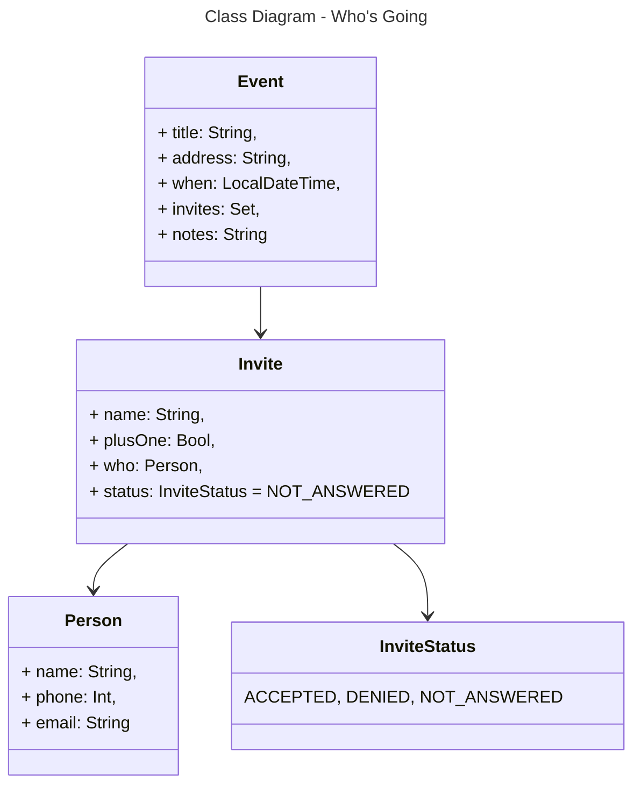

```mermaid
---
title: Class Diagram - Who's Going
---
classDiagram
    class Event {
        + title: String,
        + address: String,
        + when: LocalDateTime,
        + invites: Set<Invite>,
        + notes: String
    }

    class Invite {
        + name: String,
        + plusOne: Bool,
        + who: Person,
        + status: InviteStatus = NOT_ANSWERED
    }

    class Person {
        + name: String,
        + phone: Int,
        + email: String
    }

    class InviteStatus {
        ACCEPTED, DENIED, NOT_ANSWERED
    }

    Event --> Invite
    Invite --> Person
    Invite --> InviteStatus
```